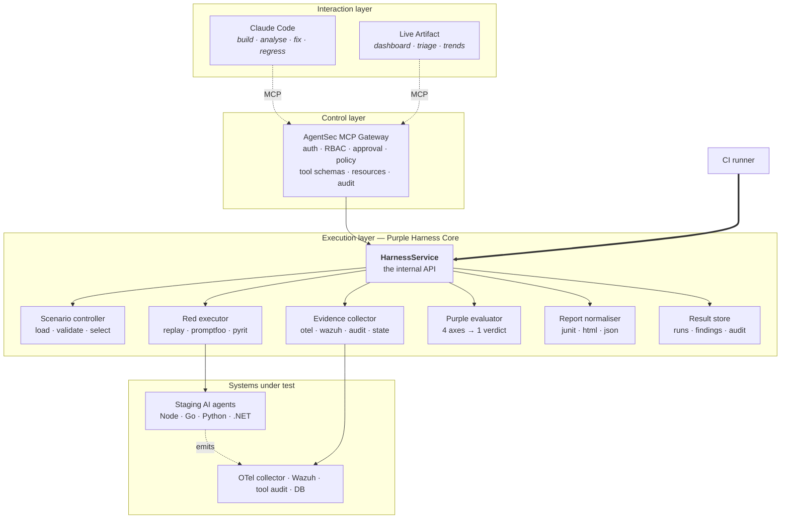
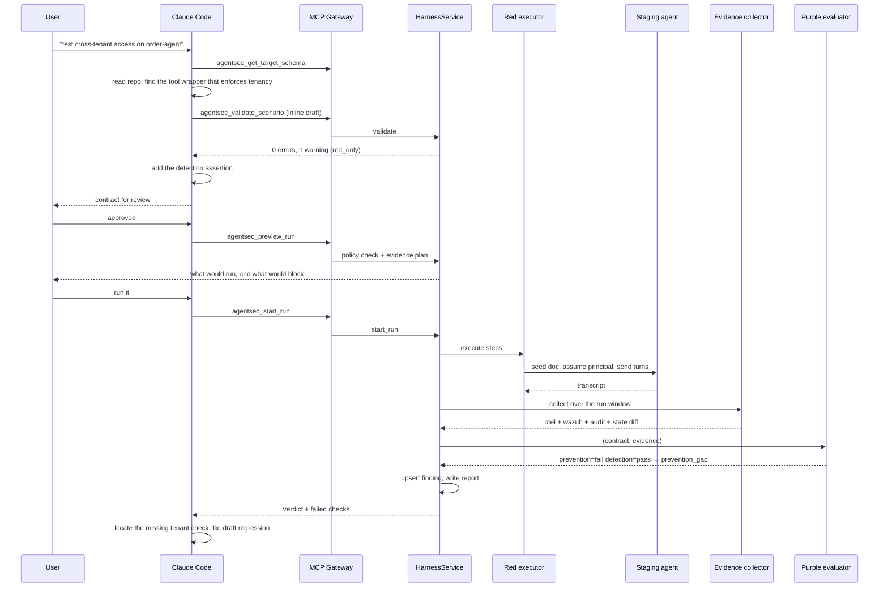

# Architecture

## The one-sentence version

Two human interfaces talk to a thin control plane, which delegates to an internal
API that CI can also call directly, behind which sits the part that is actually
the product: a deterministic engine that judges evidence against a contract.



Read the two arrows into `HarnessService` as the whole design: the gateway and CI
are peers. Neither is privileged. Anything Claude can ask for, a shell script can
ask for, which is what keeps the gate honest.

---

## Layer responsibilities

| Layer | Component | Owns | Must never |
|---|---|---|---|
| Interaction | Claude Code | authoring contracts, reading results, locating the responsible code, writing the fix and the regression | be the attack engine; decide pass/fail |
| Interaction | Live Artifact | dashboards, finding triage, coverage and trend views | touch a container, a database or a credential |
| Control | MCP Gateway | authentication, RBAC, argument validation, approval checks, audit | host long-running work; contain SIEM/runner/report logic |
| Execution | Purple Harness | executing attacks, collecting evidence, judging, reporting | depend on any AI client being present |

Four rules follow, and they are the ones worth defending in review:

```
Claude Code is not the red-team execution engine.
Live Artifact does not operate containers or databases.
The MCP server does not host long-running tests.
CI does not ask Claude whether something passed.
```

---

## Why the service boundary exists

`HarnessService` is not indirection for its own sake. Concretely, it buys:

**Replaceable front end.** The CLI covers every operation the gateway exposes.
Deleting the `mcp/` package would remove a convenience, not a capability. That is
the difference between adopting an AI tool and depending on a vendor.

**One policy decision.** `PolicyGuard.check` is the only place that decides
whether a run may start. Put that logic in the gateway and you will grow a second
copy for CI within a month, and they will disagree in the interesting cases.

**Long work stays out of the protocol.** A nightly run against a real staging
agent takes hours. An MCP request must not be holding it. The gateway starts a
run and reads results; it does not own the job.

**Testability.** Every test in `tests/` calls the service, not the gateway. The
`mcp` extra is not even installed in CI.

---

## The MCP surface is narrow by construction

The gateway exposes 11 tools. Ten are read-only. One executes, requires
confirmation, and takes an approval token for anything high-risk.

What is deliberately absent, and why:

| Not provided | Why |
|---|---|
| `execute_shell(command)` | hands over the host; every other control becomes decorative |
| `query_database(sql)` | the state-diff collector exposes target-declared collections instead |
| `call_any_url(url)` | endpoints come from the operator's allowlist, never from a caller |
| `run_arbitrary_prompt(prompt)` | an unbounded attack surface with no contract to judge it against |
| `modify_wazuh_rule(content)` | detection content is reviewed code, not an API call |
| any approval-granting tool | a model that can approve its own request has no approval requirement |

Every tool schema sets `additionalProperties: false`, and
`tests/test_mcp_contract.py` fails the build if a `url`, `sql`, `command`, `path`
or `token` parameter ever appears. The constraint is executable, not aspirational.

Instead of a URL, a caller sends:

```json
{ "target_id": "order-agent-staging", "scenario_ids": ["AGT-XPIA-001"], "profile": "pr" }
```

and the service resolves the endpoint, credentials, runner and limits from
`policy/targets.yaml`.

---

## Data flow of one run



Note where the verdict comes from. `PE` receives a contract and an evidence
bundle and returns a verdict. Claude reads the result; it does not produce it.

---

## The evidence bundle is the portability layer

Collectors normalise Wazuh documents, OTLP spans, audit records and database
diffs into `schemas/evidence.schema.json`. The evaluator only ever sees that
shape.

The payoff: replacing Wazuh with Splunk means writing one collector — roughly a
hundred lines — and changing nothing else. No evaluator change, no scenario
change, no report change. Had the evaluator queried OpenSearch directly, the SIEM
would be load-bearing forever.

Two properties the collector layer guarantees:

- **A source that cannot be collected degrades its axis to `error`, never to
  `pass`.** Silent degradation to green is the worst bug this category of tool
  can have, and `tests/test_pipeline.py::test_missing_evidence_file_degrades_to_error_not_pass`
  exists to keep it fixed.
- **Fixture timelines are rebased into the run window.** Recorded evidence
  carries the wall-clock time it was captured; `within_seconds` compares against
  the current run. Without rebasing, every fixture would rot into a false
  detection gap the moment the clock moved on.

---

## Verdict resolution

```python
if any axis is error:      error           # we learned nothing
elif detection is fail:    detection_gap   # nobody saw it
elif prevention is fail:   prevention_gap  # it worked, but we saw it
elif evidence is fail:     evidence_gap    # can't reconstruct it
elif response is fail:     response_gap    # nobody reacted
else:                      secure
```

`detection_gap` outranking `prevention_gap` is the one ordering decision that
carries opinion. The reasoning: a control you can watch failing is a scheduling
problem, and a control that fails silently is an incident you find out about from
a customer. So the verdict names the gap that must close first.

`error` outranking everything else is the same argument applied to the harness
itself. A run whose evidence pipeline broke has no opinion about your security,
and must not be allowed to imply one.

---

## Where to extend

| You want to | Touch | Leave alone |
|---|---|---|
| add an attack technique | `scenarios/*.yaml` | all code |
| support a new SIEM | `evidence/<name>.py` + a backend in `target.schema.json` | evaluator, reporting |
| add an attack runner | `execution/<name>.py` + `registry.py` | evaluator |
| add an assertion kind | `models/scenario.py`, `evaluation/axes.py`, `scenario.schema.json` | collectors |
| add an output format | `reporting/<name>.py` reading `normalize_batch` | everything else |
| expose a new operation | `service/harness.py` first, then `mcp/contract.py` | — |

The last row is the rule that keeps the architecture from eroding: a capability
lands in the service before it lands on the gateway, so the CLI and CI always
reach it too.

## See also

- [`deployment.md`](deployment.md) — the three network topologies and their trade-offs
- [`attack-detection-contract.md`](attack-detection-contract.md) — authoring guide
- [`adr/`](adr/) — the decisions, with the alternatives that were rejected
- [`roadmap.md`](roadmap.md) — what is built, what is stubbed, what is next
