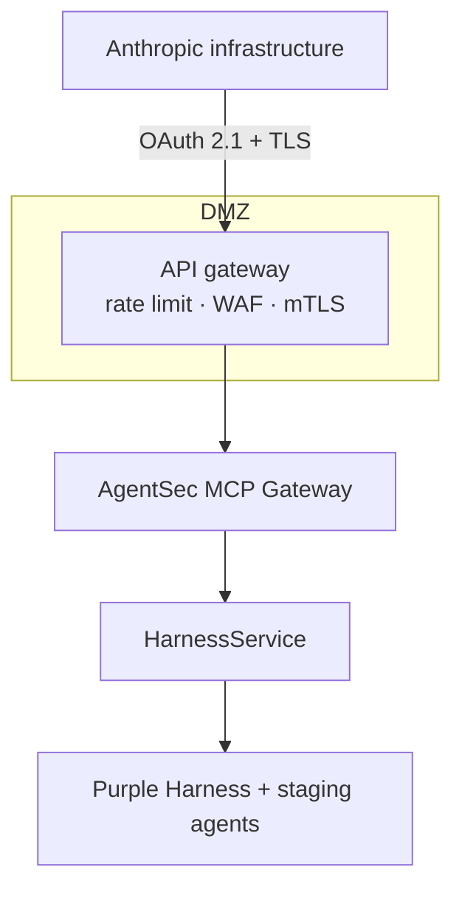
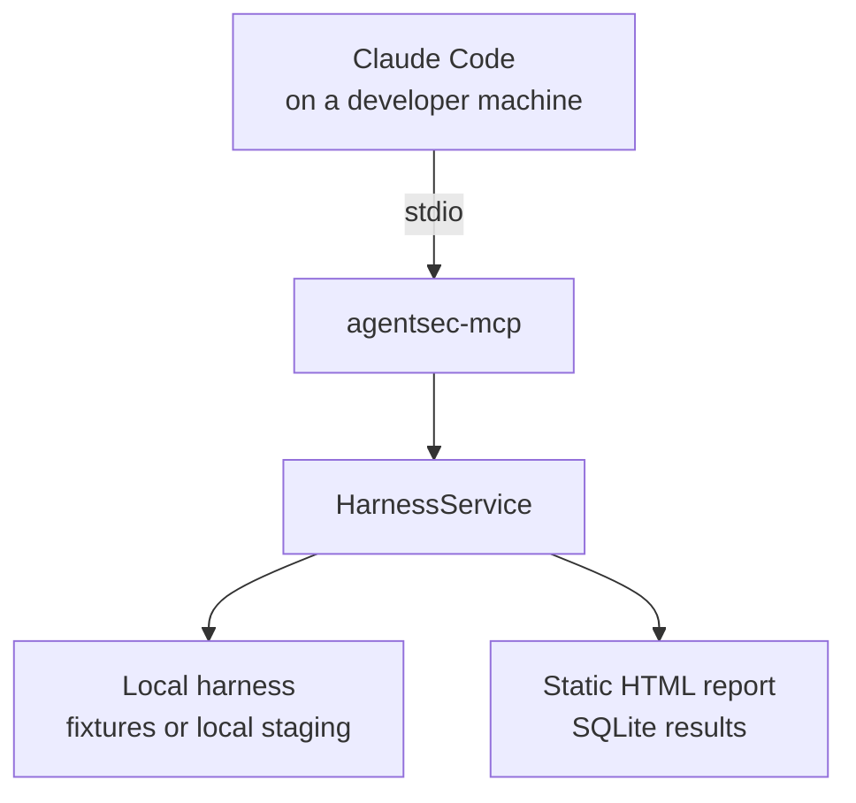
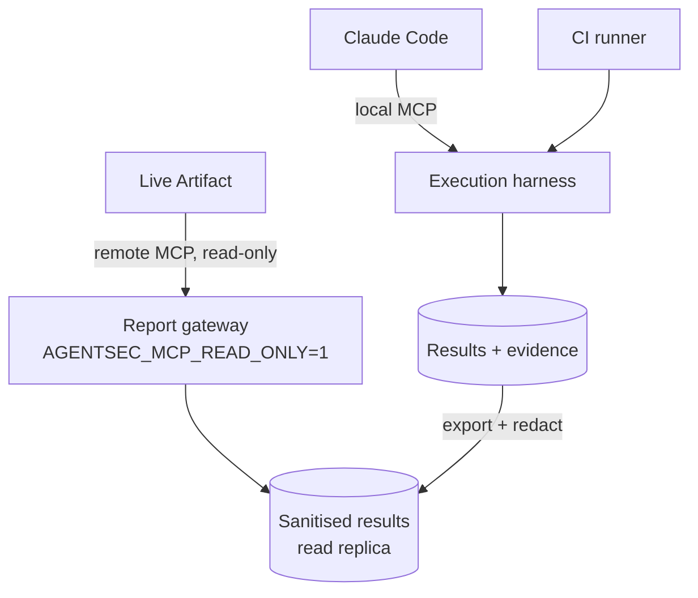

# Deployment

## The constraint that shapes everything

A remote MCP connector is dialled **from Anthropic's infrastructure to your
server**, not from the user's laptop into your network. Claude Desktop's local
MCP is a separate mechanism and does not apply to claude.ai or Cowork surfaces.

So "point a Live Artifact dashboard at our internal harness" is not a
configuration detail. It means either publishing an authenticated endpoint to the
internet, or accepting that the dashboard reads a different (sanitised) copy of
the data than the executor writes.

Verify the current connector behaviour against Anthropic's docs before you design
around it — this is the part of the stack most likely to have moved.

---

## Option A — company remote MCP



**Needs:** OAuth/OIDC, company RBAC mapped to AgentSec roles, TLS, an API gateway,
rate limiting, audit shipping, network policy, and a data-minimisation review of
everything the gateway can return.

**Suits:** a team that already runs authenticated internal APIs for SaaS
consumption and has an owner for this one.

**Cost that is easy to underestimate:** you are exposing your purple-team control
plane to the internet. Even fully read-only, the responses describe your agents'
capabilities, your detection rules and your unfixed findings — a good target
package for anyone who gets in. Run `AGENTSEC_MCP_READ_ONLY=1` and treat the
allowlist as a published document.

---

## Option B — local POC (start here)



Everything stays on one machine. No inbound network, no OAuth, no gateway.

```bash
pip install -e '.[mcp]'
claude mcp add agentsec -- agentsec-mcp    # or add to .mcp.json
```

```jsonc
// .mcp.json
{
  "mcpServers": {
    "agentsec": {
      "command": "agentsec-mcp",
      "env": { "AGENTSEC_WORKSPACE": "/abs/path/to/agentsec" }
    }
  }
}
```

**Validates, without any infrastructure commitment:** whether the Scenario
Contract expresses your real threats; whether your agents emit enough telemetry
for the evidence axis to be checkable at all; whether your Wazuh rules fire on
agent-layer attacks; whether the four-axis verdict tells your team something they
did not already know.

That last question is the one worth answering before building option A. If the
verdicts are not changing decisions, no amount of dashboard will fix it.

---

## Option C — hybrid (the realistic first team rollout)



Execution stays inside the network. The dashboard reads a redacted export.
Nothing internet-reachable can start a run — not by policy, but because
`start_run` is not registered on that process.

**The work you cannot skip:** the export step is a real component. Evidence
bundles carry transcripts, and transcripts of a cross-tenant test contain the
data that leaked. Decide per source what crosses the boundary. `Target.redacted()`
already does this for target metadata; you need the equivalent for evidence.

**Recommended sequencing:**

| Phase | Add | Gate before moving on |
|---|---|---|
| 1 | Option B, one agent, 4–6 scenarios | verdicts are changing engineering decisions |
| 2 | CI gate on the `pr` profile | the gate has caught a real regression |
| 3 | Option C read-only dashboard | someone outside the security team reads it weekly |
| 4 | Option A with RBAC and approvals | more than one team is authoring scenarios |

Skipping to phase 3 produces a dashboard nobody opens, because there is nothing
on it yet.

---

## Environment variables

| Variable | Purpose |
|---|---|
| `AGENTSEC_WORKSPACE` | workspace root holding `scenarios/`, `policy/`, `results/` |
| `AGENTSEC_DB` | override the SQLite path (CI often points this at a cache) |
| `AGENTSEC_ACTOR` | who is acting, recorded on every audit row |
| `AGENTSEC_MCP_READ_ONLY` | `1` refuses every non-read-only tool |
| `AGENTSEC_ALLOW_EXTERNAL_HOSTS` | comma-separated hosts exempt from the private-address check |
| target-specific | credential variable *names* come from `policy/targets.yaml`; the values live only in the environment |

No credential is ever written in a scenario, a target file, or a tool argument.

---

## Hardening checklist for options A and C

- [ ] `AGENTSEC_MCP_READ_ONLY=1` on any internet-reachable gateway
- [ ] OAuth scopes mapped to tool risk tiers (`read` / `write` / `execute`)
- [ ] Evidence redaction on the export path — assume transcripts contain the leak
- [ ] Approvals in your change-management system, not the YAML ledger
- [ ] `audit_log` shipped to the SIEM, including refusals
- [ ] Per-target rate limits enforced at the gateway as well as in policy
- [ ] The allowlist reviewed like a firewall change, by someone who did not write it
- [ ] Staging data is synthetic; verify this rather than assuming it
- [ ] Egress policy on the runner, so a compromised target cannot use it as a pivot
