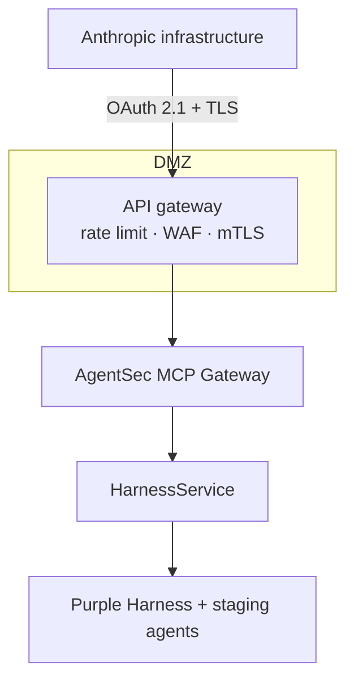
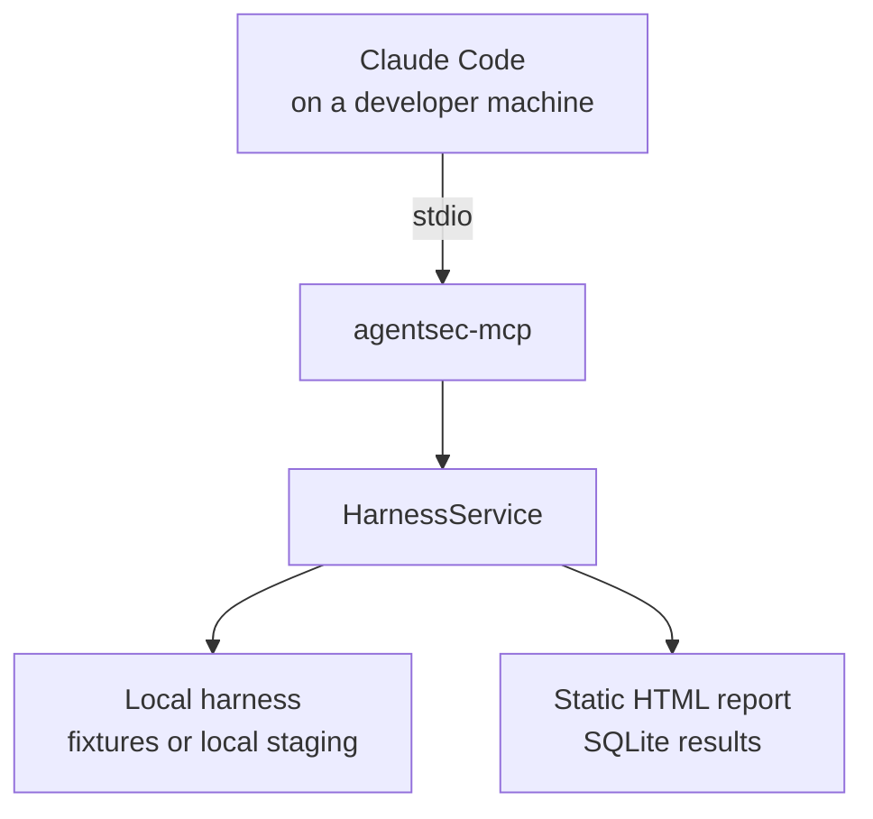
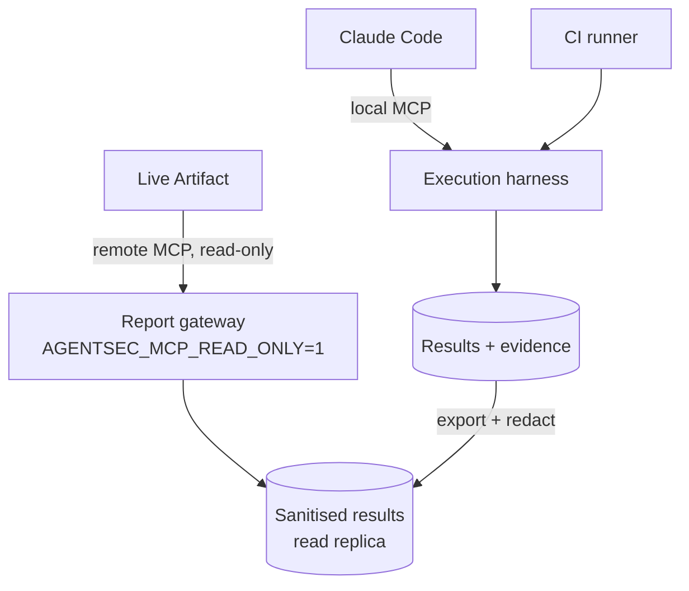

# Deployment

## Five arrangements, and which one you are on

"Point a dashboard at our harness" is not one deployment. Five arrangements get
called the same thing, and they differ in the only property that decides
everything downstream: **which machine runs the MCP server, and who dials whom.**

| | Arrangement | Where the server runs | Can it read the selected repository? |
|---|---|---|---|
| 1 | Claude Code, project-local `.mcp.json` | your machine, as a stdio child process | yes — `${CLAUDE_PROJECT_DIR}` |
| 2 | Claude Desktop, local plugin/extension | your machine, as a stdio child of the desktop app | yes — the folder the app has open |
| 3 | Cowork session running **locally** | your machine, via 2 | yes |
| 4 | Cowork session running **remotely** | a container that is not your laptop | no |
| 5 | Remote MCP connector | a server you host and expose | only what that server can reach |

Rows 1–3 are the local case: no inbound network, no OAuth, no gateway, and the
harness reads the repository you actually have open. This is **option B** below,
and it is where to start.

Row 4 is the row that gets missed. A session running in a remote container cannot
reach a stdio MCP server on your laptop, and cannot read your working tree — not
as a policy decision but because neither is present. Registering a local server
does not change that; it registers it on a machine the session is not running on.

Row 5 is the row that gets underestimated. A remote MCP connector is dialled
**from Anthropic's infrastructure to your server**, not from your laptop into
your network. So "let the dashboard read our internal harness" means either
publishing an authenticated endpoint to the internet (**option A**) or accepting
that the dashboard reads a different, sanitised copy of the data than the
executor writes (**option C**).

Rows 1 and 2 are different mechanisms and ship separately. `.mcp.json` is Claude
Code's project registration and is not a Desktop plugin; row 2 lives in
[`packaging/claude-desktop/`](../packaging/claude-desktop/) and registers the
server **read-only**. Do not read one as evidence for the other.

Verify current connector and plugin behaviour against Anthropic's docs before
designing around any of this. It is the part of the stack most likely to have
moved, and the previous edition of this page got it wrong in exactly that way: it
said local MCP "does not apply to Cowork surfaces", which is true of row 4 and
false of rows 2–3.

---

## Option A — company remote MCP



**Needs:** OAuth/OIDC, company RBAC mapped to AgentSec roles, TLS, an API gateway,
rate limiting, audit shipping, network policy, and a data-minimisation review of
everything the gateway can return.

**Suits:** a team that already runs authenticated internal APIs for SaaS
consumption and has an owner for this one.

**Cost that is easy to underestimate:** you are exposing your purple-team control
plane to the internet. Even fully read-only, the responses describe your agents'
capabilities, your detection rules and your unfixed findings — a good target
package for anyone who gets in. Run `AGENTSEC_MCP_READ_ONLY=1` and treat the
allowlist as a published document.

---

## Option B — local POC (start here)



Everything stays on one machine. No inbound network, no OAuth, no gateway. This
covers rows 1–3 of the table above, with one gap noted at the end of this
section.

```bash
pip install -e '.[mcp]'
claude mcp add agentsec -- agentsec-mcp    # or add to .mcp.json
```

```jsonc
// .mcp.json
{
  "mcpServers": {
    "agentsec": {
      "command": "agentsec-mcp",
      "env": { "AGENTSEC_WORKSPACE": "${CLAUDE_PROJECT_DIR}" }
    }
  }
}
```

That is the file this repository ships. `${CLAUDE_PROJECT_DIR}` binds the
workspace to whichever project Claude Code has open, so the server reads the
checkout you are looking at rather than one named in a committed absolute path.

### Registering the project

```bash
agentsec init            # writes .agentsec/project.yaml — review it, then commit it
agentsec project show    # what the harness can see: skills, agents, hooks, settings, MCP config
```

Selection happens twice, and neither time through a tool argument. **Which**
repository comes from the process boundary — the directory the server was
started in, which is what `${CLAUDE_PROJECT_DIR}` binds. **What inside it**
comes from `.agentsec/project.yaml`, a committed file naming relative locations
only. Absolute paths, `..`, URLs, home-relative paths and shell metacharacters
are refused before anything is read, and a symlink pointing out of the
repository is refused after resolution, since a pattern cannot see one.

Review it like `policy/targets.yaml`. It decides what the harness reads, the
`project_id` is what every later result is filed under, and no credential
belongs in it — credential *names* live in the target allowlist and their values
only in the environment.

`agentsec project show` is an inventory, never a verdict. `skill_assurance`
reports `not_tested` in every case today, distinguishing *no skill surface* from
*skills present, no evaluator*, because `skill_eval` is not built
([ADR 0008](adr/0008-skill-assurance-bounded-context.md),
[#14](https://github.com/trionnemesis/AgentSec/issues/14)). A surface that is
unreadable, malformed or unsupported becomes an entry in `problems` rather than
an absence — an empty inventory that means "we could not look" must not read
like one that means "there is nothing there".

**Claude Desktop is a separate registration.** Desktop loads local MCP servers
through its plugin/extension mechanism, not through `.mcp.json`, so a locally-run
Cowork session cannot pick this server up by copying the block above.
[`packaging/claude-desktop/`](../packaging/claude-desktop/) has both paths — a
bundle manifest and a `claude_desktop_config.json` entry — and both pin
`AGENTSEC_MCP_READ_ONLY=1`.

That last point is the design, not a default. The Desktop registration is a
*report* gateway: eight read-only tools, six published resources, and no
`agentsec_start_run` to plan around. Runs are started from the execution host —
Claude Code through `.mcp.json`, or the CLI — where the audit actor and the
approval check apply. `tests/test_packaging.py` starts a server from the
registration's own environment and asserts the execution tools are absent, so
the claim is checked rather than described.

**Validates, without any infrastructure commitment:** whether the Scenario
Contract expresses your real threats; whether your agents emit enough telemetry
for the evidence axis to be checkable at all; whether your Wazuh rules fire on
agent-layer attacks; whether the four-axis verdict tells your team something they
did not already know.

That last question is the one worth answering before building option A. If the
verdicts are not changing decisions, no amount of dashboard will fix it.

---

## Option C — hybrid (the realistic first team rollout)



Execution stays inside the network. The dashboard reads a redacted export.
Nothing internet-reachable can start a run — not by policy, but because
`start_run` is not registered on that process.

### What each side of that boundary holds

The export step used to be described here as work you had to write yourself. It
ships now, in `reporting/publish.py`, and the line it draws is between *declared
configuration* and *observed data*:

* **Declared configuration** — what an operator wrote in `policy/targets.yaml`,
  what a scenario author committed and a reviewer merged — has already been
  through review and already has its credentials withheld. It crosses.
* **Observed data** — transcript turns, span attributes, alert fields, tenant
  ids, audit detail — is whatever the system under test happened to emit. In a
  cross-tenant scenario that is, by construction, the record that leaked. It is
  projected, never passed through.

| | Execution host (local) | Report gateway (`AGENTSEC_MCP_READ_ONLY=1`) |
|---|---|---|
| Raw evidence bundle | on disk under `results/`, referenced by `run.evidence_ref` | not served, not referenced |
| `agentsec://runs/{run_id}/evidence` | projected: turn digests, pseudonymous principals, attribute keys without values | not registered |
| `agentsec://audit` | full rows | not registered |
| `agentsec://targets/{target_id}` | principals, executors, capabilities | not registered |
| `agentsec://runs/{run_id}` | projected run: no `evidence_ref`, no `raw_ref`, no approval token | same projection |
| `agentsec://dashboard/latest` | composed rollup, computed in memory | same document |
| `agentsec://project/risks` | the risk plane alone, computed in memory | same document |
| `agentsec://coverage`, `findings`, `scenarios`, `targets` | served | served |

### The document a dashboard polls

`agentsec://dashboard/latest` composes five planes and keeps them apart:

```jsonc
{
  "kind": "dashboard",
  "project":          { "status": "declared", "project_id": "…", "surfaces": { … } },
  "repo_risk":        { "status": "inspected", "counts": { … }, "verify_queue": [ … ] },
  "purple":           { /* the four-axis rollup — schemas/dashboard.schema.json */ },
  "skill_assurance":  { "status": "not_tested", "reason": "no_evaluator" },
  "static_posture":   { "status": "not_tested", "reason": "no_report" }
}
```

Composition, not merging. A repository risk, a Skill outcome, and a static
scanner's finding never enter `verdict_counts`, `axis_counts` or a
`PurpleVerdict`: each plane answers a different question, and a single number
averaging them answers none. `repo_risk` is the plane an engineer sees first,
and the only one that says anything with no target configured: it reports what
this repository's own agent configuration exposes, and per risk whether a
scenario could settle it (`verified` / `verifiable` / `not_verifiable`). It is
never a verdict — nothing in it has executed anything
([ADR 0009](adr/0009-repository-first-golden-path.md)). `skill_assurance` is `not_tested` in every case today, because
`skill_eval` is not built
([ADR 0008](adr/0008-skill-assurance-bounded-context.md),
[#14](https://github.com/trionnemesis/AgentSec/issues/14)), and it says which
absence it means rather than reporting an empty pass. `static_posture` follows
the same rule for a different reason: most repositories have not configured a
scanner report at all.

#### What an ingested static posture report may and may not do (#25)

A static scanner such as [AgentShield](https://github.com/affaan-m/agentshield)
answers *"is this configuration risky?"* by rule, with no proof of
exploitation. AgentSec answers *"did an attack work, and would the blue side
have seen it?"* from executed evidence. `static_posture` exists to name the gap
between the two, never to close it by fiat:

* **A grade is never a verdict.** Ingesting a report with grade `A` and zero
  purple scenarios leaves the posture plane `ingested` and `purple` untouched
  — the overall project is not `secure` because a scanner said so, and never
  will be.
* **Composition, not merging.** `static_posture` is a fourth property beside
  `project` / `purple` / `skill_assurance`, with its own status enum
  (`not_tested` / `ingested` / `error` — deliberately not `pass`/`fail`, so it
  cannot be mistaken for a verdict-shaped plane). It is never a fifth axis.
* **No scanner is a dependency.** Nothing here runs, installs or vendors one.
  Ingestion reads a report file from the location declared in
  `.agentsec/project.yaml: static_posture_report`; a missing report is
  `not_tested`, never green and never an install prompt.
* **Coverage, not a scan count.** Each finding is correlated against the
  surfaces `agentsec project show` discovered and the scenarios that actually
  produced a verdict (not merely exist in the catalogue), reported as
  `covered`, `not_tested` or `n/a`. `not_tested` is the default: being scanned
  is not the same as being tested.
* **Findings are observed data.** They name files and can quote a scanner's
  own rule description; the matched source text is never captured in the
  first place (`models/posture.py`), and the publisher projects only rule id,
  severity, category, file path and coverage state.
* **A file outside the project root is refused, not ingested.** A finding
  naming a location `project.resolver.safe_child` would refuse from a
  manifest is recorded as a problem, the same as any other declared location
  that tries to escape.

See [issue #25](https://github.com/trionnemesis/AgentSec/issues/25) for the
full non-negotiables and acceptance matrix.

Two properties a page's author cannot verify for themselves, so both are
enforced here:

* **The read is a read.** It is computed from the store in memory and writes
  nothing — deliberately not implemented by calling `agentsec_generate_report`,
  whose whole purpose is to write an HTML and a JSON file. An artifact that
  refreshes itself must not leave a trail of reports behind it.
* **The shape is the shape.** Every response is validated against
  `schemas/project-dashboard.schema.json` before it is served, and a document
  that does not match is refused. A consumer that pinned to the schema cannot
  see a silently-changed field; it can see an error.

Raw evidence is a local capability on purpose. An investigator working an
incident reads the bundle off the execution host — as a file, or through the
report the CLI renders there. Nothing that crosses the MCP boundary carries it,
on either gateway, because the difference between the two is which URIs exist
rather than how carefully each one is rendered.

**What the projection keeps.** Redaction that costs the reader the finding is
not worth deploying. Verdicts, axis statuses, failed checks, rule ids, alert
levels, tool names and decisions all survive intact — the assertion text quotes
values declared in the contract, so it survives too. What goes is the payload:
turn content becomes a digest, free-form maps keep their keys and lose their
values, principals and tenant ids become stable pseudonyms that still correlate
across turns so the pivot remains visible.

**Pseudonyms are not anonymisation.** They preserve correlation without printing
the identifier. The identifier space is small and the default salt ships in the
source, so anyone holding both can invert them by enumeration. Set
`AGENTSEC_PSEUDONYM_SALT` per deployment when the reader is less trusted than
whoever can read the repository.

**Adding a resource is a decision, not a default.** Every `ResourceSpec` names a
publication policy, and the gateway refuses to start if one names a policy that
does not exist. A new resource whose output nobody has vetted fails on the
machine of whoever added it rather than serving a raw model in production.

The published shapes are versioned — `reporting.publish.PUBLISH_SCHEMA_VERSION`,
with the rollup described by `schemas/dashboard.schema.json` — so a Live Artifact
or MCP App can pin against them.

### Three dashboards, and which one you are looking at

| | What it is | Freshness |
|---|---|---|
| `docs/reviews/assets/purple-dashboard.html` | a **design reference**, rendered once from a real run | correct on the day it was written and never again |
| `agentsec dashboard --html out.html` | a **snapshot** of the store, from the same template as the Artifact | correct at the moment it was written |
| The **Live Artifact** | the same page holding an MCP connection to `agentsec://dashboard/latest` | re-read on every refresh |

The template is shared on purpose. A reader comparing a snapshot attached to a
ticket with the live page is then comparing data rather than two renderers.

The page renders from the *published* document — the one `publish("dashboard", …)`
returned — and never reaches back into the store. That is what makes "this page
cannot show you an evidence bundle" a property of the plumbing rather than of the
template's good manners, and `tests/test_packaging.py` asserts it by taking the
transcripts the runs actually produced and checking that none of them appears in
the rendered page.

What survives is the evaluator's account: which assertion failed, what it
observed, why it matters. Assertion text quotes values the scenario author
committed, so `ORD-B-77421` does appear on the page — as declared configuration
inside a failed check, not as transcript content. Redaction that costs the reader
the finding would not be worth deploying.

**Refresh is structurally read-only.** Opening, filtering and refreshing the
Artifact start no run, write no file and move no finding — not by policy but
because the gateway it binds to has no tool that could, and the one resource it
polls is computed in memory.

**Recommended sequencing:**

| Phase | Add | Gate before moving on |
|---|---|---|
| 1 | Option B, one agent, 4–6 scenarios | verdicts are changing engineering decisions |
| 2 | CI gate on the `pr` profile | the gate has caught a real regression |
| 3 | Option C read-only dashboard | someone outside the security team reads it weekly |
| 4 | Option A with RBAC and approvals | more than one team is authoring scenarios |

Skipping to phase 3 produces a dashboard nobody opens, because there is nothing
on it yet.

---

## Environment variables

| Variable | Purpose |
|---|---|
| `AGENTSEC_WORKSPACE` | workspace root holding `scenarios/`, `policy/`, `results/` |
| `AGENTSEC_DB` | override the SQLite path (CI often points this at a cache) |
| `AGENTSEC_ACTOR` | who is acting, recorded on every audit row |
| `AGENTSEC_MCP_READ_ONLY` | `1` runs the report gateway: non-read-only tools are not registered, and only the allowlisted resources are served |
| `AGENTSEC_PSEUDONYM_SALT` | salt for the principal/tenant/actor labels in published output; defaults to a value that ships in the source |
| `AGENTSEC_ALLOW_EXTERNAL_HOSTS` | comma-separated hosts exempt from the private-address check |
| target-specific | credential variable *names* come from `policy/targets.yaml`; the values live only in the environment |

No credential is ever written in a scenario, a target file, or a tool argument.

---

## Hardening checklist for options A and C

- [ ] `AGENTSEC_MCP_READ_ONLY=1` on any internet-reachable gateway
- [ ] OAuth scopes mapped to tool risk tiers (`read` / `write` / `execute`)
- [x] Evidence redaction on the export path — assume transcripts contain the leak
      (`reporting/publish.py`; the projection is asserted against the
      cross-tenant corpus in `tests/test_publish_redaction.py`)
- [ ] `AGENTSEC_PSEUDONYM_SALT` set, if the dashboard's readers should not be
      able to invert principal labels by enumeration
- [ ] Approvals in your change-management system, not the YAML ledger
- [ ] `audit_log` shipped to the SIEM, including refusals
- [ ] Per-target rate limits enforced at the gateway as well as in policy
- [ ] The allowlist reviewed like a firewall change, by someone who did not write it
- [ ] Staging data is synthetic; verify this rather than assuming it
- [ ] Egress policy on the runner, so a compromised target cannot use it as a pivot
